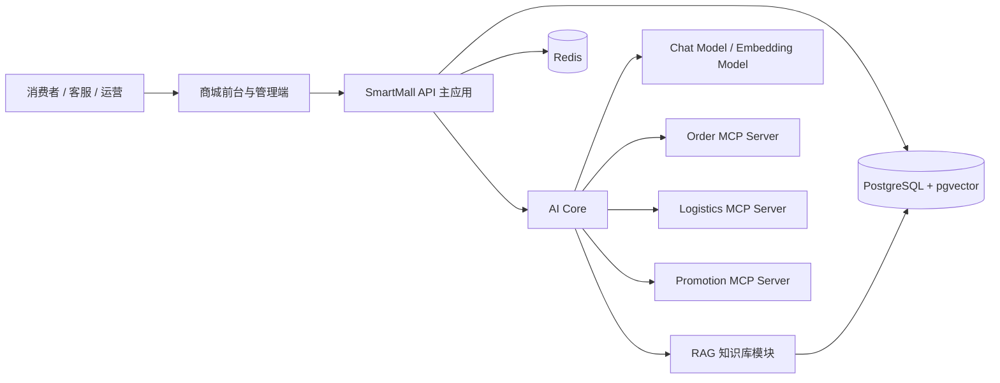
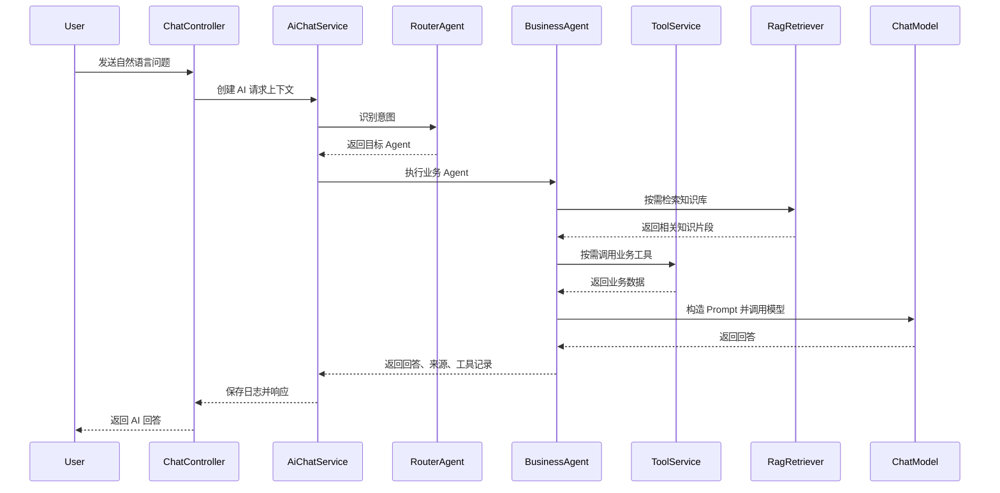
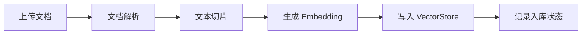
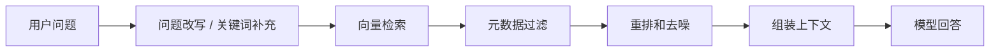
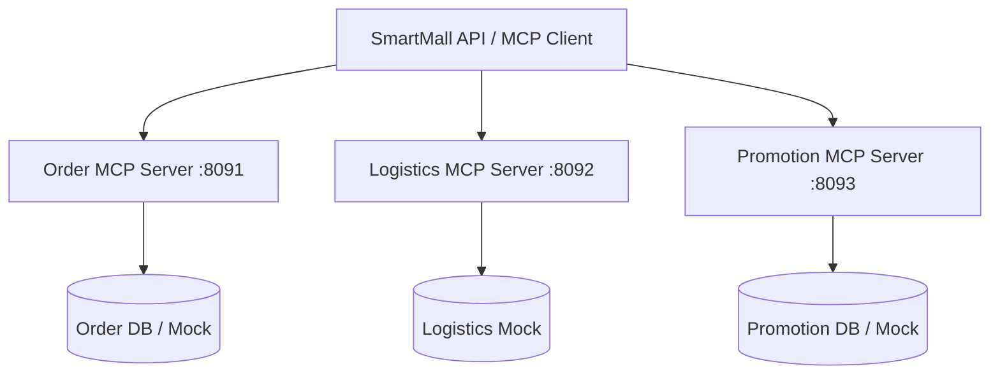

# 智能商城 AI 助理平台技术架构文档

## 1. 架构目标

本项目的技术架构目标是通过一个中型商城项目系统性实践 Spring AI 相关能力。架构需要同时满足普通商城业务开发、AI 对话开发、RAG 知识库开发、多 Agent 编排、MCP 外部工具集成和 AI 可观测性建设。

核心目标：

1. 业务模块清晰，商品、订单、库存、优惠、售后等模块可以独立演进。
2. AI 能力可插拔，模型供应商、向量库、Prompt、Agent、工具可以独立替换。
3. RAG 链路完整，支持文档入库、向量检索、上下文增强和来源追踪。
4. 多 Agent 职责明确，避免一个超大 Prompt 承载所有业务逻辑。
5. MCP 集成标准化，模拟真实企业中 AI 应用调用外部系统的方式。
6. 全链路可观测，能够追踪一次 AI 请求经过的模型、Agent、RAG 和工具调用。

## 2. 推荐技术栈

### 2.1 后端技术

| 技术 | 用途 |
| --- | --- |
| Java 21 | 后端开发语言 |
| Spring Boot 3.x | 应用基础框架 |
| Spring Web | REST API 和 SSE 流式接口 |
| Spring Security | 认证和权限控制 |
| Spring Data JPA 或 MyBatis Plus | 数据访问 |
| Spring AI | AI 模型调用、RAG、Tool Calling、MCP |
| PostgreSQL | 业务数据库 |
| pgvector | 向量检索 |
| Redis | 缓存、会话、限流 |
| Docker Compose | 本地开发环境编排 |

### 2.2 AI 相关组件

| 组件 | 用途 |
| --- | --- |
| ChatClient | 构建同步和流式对话 |
| Advisor API | 问答增强、记忆增强、RAG 增强 |
| Tool Calling | 让模型调用业务工具 |
| VectorStore | 向量存储和相似度检索 |
| EmbeddingModel | 生成文本向量 |
| MCP Client | 主应用连接外部 MCP Server |
| MCP Server | 对外暴露订单、物流、优惠等能力 |

### 2.3 前端技术

| 技术 | 用途 |
| --- | --- |
| Vue 3 或 React | 前端框架 |
| TypeScript | 类型约束 |
| Element Plus 或 Ant Design | 管理端组件库 |
| SSE Client | 接收流式 AI 回复 |

## 3. 总体架构



主应用负责普通业务接口和 AI 编排。AI Core 负责 ChatClient、Agent、Prompt、Tool Calling 和 Advisor。RAG 模块负责知识库入库和检索。MCP Server 负责模拟外部系统能力。

## 4. 工程结构

建议使用多模块工程：

```text
smartmall-ai
├── smartmall-api
├── smartmall-common
├── smartmall-domain
├── smartmall-ai-core
├── smartmall-rag
├── smartmall-mcp-order-server
├── smartmall-mcp-logistics-server
├── smartmall-mcp-promotion-server
└── smartmall-web
```

### 4.1 smartmall-api

主应用启动模块，负责：

1. REST API。
2. Spring Security 配置。
3. 业务服务组装。
4. AI 对话入口。
5. 管理端接口。

### 4.2 smartmall-common

通用模块，负责：

1. 通用响应结构。
2. 通用异常。
3. 错误码。
4. 分页模型。
5. 工具类。
6. TraceId 上下文。

### 4.3 smartmall-domain

领域模块，负责：

1. 商品领域模型。
2. 订单领域模型。
3. 库存领域模型。
4. 优惠券领域模型。
5. 售后领域模型。
6. Repository 或 Mapper。

### 4.4 smartmall-ai-core

AI 核心模块，负责：

1. ChatClient 配置。
2. Prompt 模板管理。
3. Agent 定义和路由。
4. Tool Calling 工具注册。
5. Advisor 配置。
6. 对话记忆。
7. 模型调用日志。

### 4.5 smartmall-rag

RAG 模块，负责：

1. 文档上传。
2. 文档解析。
3. 文本切分。
4. Embedding 生成。
5. VectorStore 写入。
6. 相似度检索。
7. RAG 命中日志。

### 4.6 MCP Server 模块

MCP Server 拆成三个独立应用：

1. smartmall-mcp-order-server：订单和售后能力。
2. smartmall-mcp-logistics-server：物流轨迹和预计送达能力。
3. smartmall-mcp-promotion-server：优惠券和活动价格计算能力。

### 4.7 smartmall-web

前端模块，包含：

1. 商城用户端。
2. AI 聊天窗口。
3. 管理端商品管理。
4. 管理端知识库管理。
5. 管理端 AI 日志查看。

## 5. 后端分层设计

```text
Controller
  -> Application Service
      -> Domain Service
          -> Repository / Mapper
      -> AI Service
          -> Agent
          -> Tool
          -> RAG Retriever
          -> MCP Client
```

### 5.1 Controller 层

负责请求参数接收、鉴权上下文读取、参数校验和响应封装，不编写复杂业务逻辑。

### 5.2 Application Service 层

负责用例编排，例如创建订单、发起 AI 问答、上传知识文档、触发向量化任务。

### 5.3 Domain Service 层

负责核心业务规则，例如库存扣减、订单状态流转、优惠计算、售后条件判断。

### 5.4 AI Service 层

负责模型调用和 AI 链路编排，包括意图识别、Agent 路由、工具调用、RAG 检索、结果后处理。

### 5.5 Infrastructure 层

负责数据库、Redis、模型供应商、MCP 服务、对象存储等外部依赖。

## 6. AI 架构

### 6.1 AI 请求主链路



### 6.2 Agent 设计

| Agent | 职责 | 主要工具 | RAG 范围 |
| --- | --- | --- | --- |
| Router Agent | 识别意图并路由 | 无或轻量分类工具 | 无 |
| Product Advisor Agent | 商品推荐、商品对比 | 商品搜索、商品详情、库存、优惠 | 商品说明、评论摘要 |
| Knowledge QA Agent | 商品知识和平台规则问答 | 商品详情 | FAQ、说明书、政策 |
| Order Agent | 订单、物流、支付状态查询 | 订单查询、物流查询 | 订单相关 FAQ |
| After-Sales Agent | 退换货、维修、退款咨询 | 订单查询、售后状态、工单创建 | 售后政策、保修政策 |
| Promotion Agent | 优惠券、满减、活动咨询 | 优惠券查询、价格计算 | 活动规则 |
| Operation Agent | 运营内容生成 | 商品详情、评论摘要 | 商品文档、评论 |

### 6.3 Agent 路由策略

Router Agent 输出结构化结果：

```json
{
  "intent": "PRODUCT_RECOMMENDATION",
  "targetAgent": "PRODUCT_ADVISOR",
  "confidence": 0.92,
  "slots": {
    "category": "蓝牙耳机",
    "budget": 500,
    "scenario": "跑步"
  }
}
```

当置信度低于阈值时，系统应选择：

1. 追问用户补充信息。
2. 降级到 Knowledge QA Agent。
3. 交给通用客服 Agent。

### 6.4 Prompt 管理

Prompt 建议存放在资源目录或数据库中：

```text
prompts
├── router-system.md
├── product-advisor-system.md
├── knowledge-qa-system.md
├── order-agent-system.md
├── after-sales-agent-system.md
├── promotion-agent-system.md
└── operation-agent-system.md
```

Prompt 设计原则：

1. 每个 Agent 只描述自己的职责。
2. 明确哪些信息必须来自工具。
3. 明确哪些信息必须来自知识库。
4. 明确不能编造价格、库存、政策、订单状态。
5. 明确输出格式。
6. 明确安全边界。

## 7. RAG 架构

### 7.1 知识入库链路



### 7.2 知识检索链路



### 7.3 文档类型

| 文档类型 | 说明 | 典型来源 |
| --- | --- | --- |
| PRODUCT_MANUAL | 商品说明书 | PDF、Markdown |
| PRODUCT_DETAIL | 商品详情 | 商品数据库 |
| FAQ | 常见问题 | 运营维护 |
| AFTER_SALES_POLICY | 售后政策 | 平台规则 |
| PROMOTION_RULE | 活动规则 | 营销配置 |
| REVIEW_SUMMARY | 评论摘要 | 评论模块 |
| CUSTOMER_SERVICE_SCRIPT | 客服话术 | 客服沉淀 |

### 7.4 切片策略

建议初始配置：

1. chunkSize：500 到 800 中文字符。
2. overlap：80 到 120 中文字符。
3. topK：3 到 6。
4. similarityThreshold：0.70 到 0.80。
5. 按标题、章节、商品 ID、分类 ID 添加 metadata。

### 7.5 检索过滤策略

根据不同场景使用不同过滤条件：

1. 商品问答：优先过滤 productId，其次 categoryId。
2. 售后政策：过滤 docType = AFTER_SALES_POLICY。
3. 优惠活动：过滤 docType = PROMOTION_RULE。
4. 通用 FAQ：过滤 docType = FAQ。

## 8. Tool Calling 架构

### 8.1 工具分类

| 类型 | 示例 | 来源 |
| --- | --- | --- |
| 本地业务工具 | searchProducts、getInventory | Spring Bean |
| RAG 工具 | searchKnowledge | RAG 模块 |
| MCP 工具 | logistics.getTrace、promotion.calculateBestPrice | MCP Server |
| 安全确认工具 | confirmCancelOrder、confirmCreateRefund | 本地业务服务 |

### 8.2 工具调用原则

1. 工具参数必须使用结构化对象。
2. 工具调用前进行用户权限校验。
3. 工具调用后只返回必要字段。
4. 工具调用全量记录日志。
5. 修改类工具必须二次确认。
6. 工具异常时返回可理解的降级信息。

### 8.3 本地工具与 MCP 工具边界

本地工具适合：

1. 与主应用同库同域的能力。
2. 高频低延迟能力。
3. 需要强事务一致性的能力。

MCP 工具适合：

1. 模拟外部系统。
2. 独立部署服务。
3. 多应用共享能力。
4. 需要标准协议暴露给 AI 应用的能力。

## 9. MCP 架构

### 9.1 MCP 部署拓扑



### 9.2 MCP Server 设计

每个 MCP Server 只暴露一个领域的工具：

1. Order MCP Server：订单和售后状态。
2. Logistics MCP Server：物流轨迹和预计送达。
3. Promotion MCP Server：优惠券和价格计算。

### 9.3 MCP Client 管理

主应用需要支持：

1. 多 MCP Server 配置。
2. 启动时连接和健康检查。
3. 获取工具列表。
4. 将工具注册给指定 Agent。
5. MCP 调用超时控制。
6. MCP 调用失败降级。

## 10. 数据架构

### 10.1 业务数据

业务数据包括用户、商品、分类、SKU、库存、订单、优惠券、评论、售后等。所有核心业务状态以数据库为准，AI 只负责查询、解释和辅助决策。

### 10.2 AI 数据

AI 数据包括会话、消息、模型调用、Agent 执行、工具调用和 RAG 命中。AI 日志需要支持审计和问题复盘。

### 10.3 知识库数据

知识库包括原始文档、文档切片、向量数据和元数据。向量数据建议存储在 PostgreSQL + pgvector 中，后续可替换为 Qdrant、Milvus 等专用向量数据库。

## 11. 安全架构

### 11.1 用户权限

1. 消费者只能访问自己的数据。
2. 客服可查看必要售后和订单信息。
3. 运营可管理商品和知识库。
4. 管理员可查看系统配置和日志。

### 11.2 AI 安全边界

1. AI 不得直接访问数据库。
2. AI 必须通过工具获取业务数据。
3. 工具层必须校验权限。
4. Prompt 中明确禁止编造价格、库存、订单状态和政策。
5. 知识库内容不得覆盖系统规则。

### 11.3 敏感信息保护

1. 日志中手机号、地址等敏感信息需要脱敏。
2. AI 回复中避免暴露不必要的个人信息。
3. 管理端日志查询需要权限控制。

## 12. 可观测性架构

### 12.1 Trace 关联

每次请求生成 traceId，并贯穿：

1. HTTP 请求。
2. Agent 执行。
3. RAG 检索。
4. 模型调用。
5. 工具调用。
6. MCP 调用。

### 12.2 日志类型

| 日志 | 说明 |
| --- | --- |
| model_call_log | 模型调用日志 |
| ai_agent_trace | Agent 执行轨迹 |
| ai_tool_invocation | 工具调用日志 |
| rag_hit_log | RAG 命中日志 |
| knowledge_document | 知识文档状态 |
| knowledge_chunk | 知识切片状态 |

### 12.3 指标建议

1. 模型平均耗时。
2. 首 token 响应时间。
3. Token 使用量。
4. 工具调用成功率。
5. RAG 平均命中分数。
6. MCP 服务可用率。
7. Agent 路由分布。
8. 用户反馈满意率。

## 13. 部署架构

### 13.1 本地开发

建议使用 Docker Compose 启动：

1. PostgreSQL + pgvector。
2. Redis。
3. SmartMall API。
4. Order MCP Server。
5. Logistics MCP Server。
6. Promotion MCP Server。
7. 前端开发服务器。

### 13.2 端口规划

| 服务 | 端口 |
| --- | --- |
| smartmall-api | 8080 |
| smartmall-web | 5173 |
| order-mcp-server | 8091 |
| logistics-mcp-server | 8092 |
| promotion-mcp-server | 8093 |
| PostgreSQL | 5432 |
| Redis | 6379 |

### 13.3 环境变量

| 变量 | 说明 |
| --- | --- |
| DB_URL | 数据库连接 |
| DB_USERNAME | 数据库用户名 |
| DB_PASSWORD | 数据库密码 |
| REDIS_HOST | Redis 地址 |
| SPRING_AI_MODEL_PROVIDER | 模型供应商 |
| SPRING_AI_API_KEY | 模型 API Key |
| EMBEDDING_MODEL | Embedding 模型 |
| VECTOR_DIMENSION | 向量维度 |
| MCP_ORDER_ENDPOINT | Order MCP 地址 |
| MCP_LOGISTICS_ENDPOINT | Logistics MCP 地址 |
| MCP_PROMOTION_ENDPOINT | Promotion MCP 地址 |

## 14. 关键开发顺序

### 14.1 第一阶段：基础商城

1. 创建工程结构。
2. 建立数据库表。
3. 完成商品、SKU、库存、订单基础接口。
4. 准备模拟数据。

### 14.2 第二阶段：ChatClient

1. 接入模型配置。
2. 实现普通聊天接口。
3. 实现 SSE 流式接口。
4. 保存会话和消息。

### 14.3 第三阶段：Tool Calling

1. 封装商品搜索工具。
2. 封装库存查询工具。
3. 封装订单查询工具。
4. 封装优惠计算工具。
5. 记录工具调用日志。

### 14.4 第四阶段：RAG

1. 上传知识文档。
2. 解析文档。
3. 文本切片。
4. 生成 Embedding。
5. 写入向量库。
6. 接入 Knowledge QA Agent。

### 14.5 第五阶段：多 Agent

1. 实现 Router Agent。
2. 实现各业务 Agent。
3. 隔离每个 Agent 的 Prompt、工具和知识范围。
4. 记录 Agent Trace。

### 14.6 第六阶段：MCP

1. 创建三个 MCP Server。
2. 主应用接入 MCP Client。
3. 将 MCP 工具注册给对应 Agent。
4. 完成 MCP 调用日志和降级。

### 14.7 第七阶段：评估与优化

1. 建立测试问题集。
2. 评估意图识别准确率。
3. 评估工具调用准确率。
4. 评估 RAG 命中质量。
5. 优化 Prompt、topK、阈值和工具返回结构。

## 15. 风险与应对

| 风险 | 表现 | 应对 |
| --- | --- | --- |
| AI 编造信息 | 虚构库存、价格、政策 | 强制工具调用和 RAG 来源引用 |
| RAG 命中质量低 | 答非所问 | 优化切片、metadata、topK、阈值 |
| Agent 路由错误 | 问题分发到错误 Agent | 增加结构化意图测试集 |
| 工具调用参数错误 | 模型生成错误参数 | 使用强类型 DTO 和参数校验 |
| MCP 不稳定 | 外部工具超时 | 设置超时、重试和降级 |
| Prompt 难维护 | 规则散落代码中 | Prompt 文件化和版本化 |

## 16. 推荐目录结构

```text
src/main/java/com/example/smartmall
├── auth
├── user
├── product
├── inventory
├── order
├── coupon
├── review
├── aftersales
├── knowledge
├── ai
│   ├── chat
│   ├── agent
│   ├── advisor
│   ├── prompt
│   ├── tool
│   ├── memory
│   └── observability
├── rag
│   ├── document
│   ├── ingestion
│   ├── embedding
│   └── retriever
├── mcp
├── security
└── common
```

## 17. 推荐测试策略

### 17.1 单元测试

1. 商品检索条件转换。
2. 优惠计算。
3. 订单状态流转。
4. 售后条件判断。
5. Agent 路由解析。

### 17.2 集成测试

1. 商品推荐工具调用。
2. 订单查询工具调用。
3. 知识库上传和检索。
4. MCP 工具调用。

### 17.3 AI 场景测试

1. 商品推荐问题集。
2. 售后政策问题集。
3. 订单物流问题集。
4. 优惠活动问题集。
5. 运营内容生成问题集。

### 17.4 质量评估指标

1. 意图识别准确率。
2. 工具调用准确率。
3. RAG 命中准确率。
4. 答案事实一致性。
5. 用户反馈满意率。
